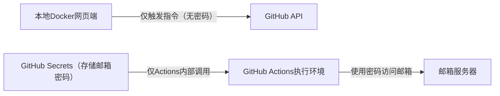

### 一、核心结论：**绝对不要将邮箱密码放在Docker参数/指令中传输**
邮箱密码属于极高敏感信息，直接通过Docker参数、API请求体、日志等方式传输/存储，会导致密码泄露（如Docker日志、进程列表、网络抓包均可获取）。以下是兼顾“安全隐私”和“功能实现”的核心设计方案：

### 二、敏感信息安全管控架构


### 三、关键安全设计点（核心是“密码仅在GitHub侧存储/使用，本地永不接触”）
#### 1. 敏感信息存储：仅存于GitHub Secrets（本地/Docker完全隔离）
- **核心原则**：邮箱密码、IMAP密钥等敏感信息，**只保存在GitHub仓库的Secrets中**（仓库 → Settings → Secrets and variables → Actions），本地Docker/网页端完全不接触、不传输、不存储这些密码；
- **优势**：GitHub Secrets采用加密存储，仅在Actions工作流执行时临时解密，且仅限仓库授权人员可见，安全性远高于本地/Docker存储。

#### 2. 指令触发：本地仅传“非敏感参数”，无密码传输
- 本地Docker网页端调用GitHub API触发Actions时，**仅传递非敏感参数**（如“结果文件格式”“提取时间范围”“本地保存路径（仅本地用）”），绝对不包含任何密码；
- 示例触发参数：
  ```json
  {
    "event_type": "extract-reimbursement",
    "client_payload": {
      "file_format": "csv",
      "time_range": "7d"
    }
  }
  ```

#### 3. 密码使用：仅在GitHub Actions内部调用
- GitHub Actions工作流执行时，从Secrets中读取邮箱密码（如`${{ secrets.EMAIL_PASSWORD }}`），直接注入代码执行环境；
- 代码中通过环境变量读取密码，全程不落地、不打印、不日志，用完即销毁：
  ```yaml
  # GitHub Actions工作流示例
  steps:
    - name: 执行提取代码
      env:
        EMAIL_USER: ${{ secrets.EMAIL_USER }}
        EMAIL_PASS: ${{ secrets.EMAIL_PASSWORD }}
        EMAIL_IMAP: ${{ secrets.EMAIL_IMAP_HOST }}
      run: python main.py --format csv --range 7d
  ```

#### 4. 本地Docker的安全补充（仅做指令触发/结果接收）
- 本地Docker仅存储“GitHub PAT（最小权限）”：用于调用GitHub API触发Actions，PAT仅授予`workflow`和`actions:read`权限（无仓库代码读写、无Secrets访问权限）；
- PAT存储方式：通过Docker环境变量（`-e GITHUB_PAT=xxx`）注入，或挂载本地加密配置文件（如`.env`，添加到`.dockerignore`避免提交），**绝不硬编码**；
- 本地Docker容器运行时：以非root用户执行，限制文件/网络权限，避免容器被攻破后泄露PAT。

#### 5. 结果回传：仅传输数据文件，无敏感信息
- GitHub Actions执行完成后，仅将提取的报销数据文件（无密码）通过GitHub Artifacts/临时对象存储回传；
- 本地Docker下载文件后，写入配置的本地文件夹，全程无敏感信息传输。

### 四、绝对禁止的不安全做法
1. ❌ 禁止将邮箱密码放在Docker run参数（`docker run -e EMAIL_PASS=xxx`）中（`ps`命令可直接看到）；
2. ❌ 禁止将密码写入Docker镜像（镜像泄露即密码泄露）；
3. ❌ 禁止在API请求体/日志中包含密码（网络抓包、日志审计可获取）；
4. ❌ 禁止本地Docker容器内存储密码文件（容器挂载/破解易获取）。

### 五、总结
核心安全逻辑：**敏感密码“锁在GitHub侧”，本地仅传“触发指令”，密码全程不经过本地/Docker**。
1. 敏感信息存储：GitHub Secrets（加密、最小权限）；
2. 指令触发：本地仅传非敏感参数，用最小权限PAT调用GitHub API；
3. 密码使用：仅在GitHub Actions内部临时使用，不落地、不传输；
4. 本地Docker：仅做触发/接收，无敏感信息存储/传输。

这种方案既满足“本地触发、GitHub执行、本地保存结果”的需求，又能最大化保护邮箱密码等敏感信息，符合企业级安全规范。