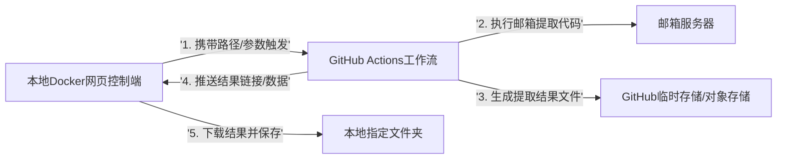

你的这个调整方案**完全可行**！核心逻辑变为「本地Docker网页端发指令 → GitHub Actions执行核心代码 → 结果回传本地」，既利用GitHub的算力执行代码，又保留本地可视化配置和结果存储的灵活性。以下是调整后的核心架构和关键设计点：

### 一、调整后整体架构

核心层级拆解：
1. **本地控制层**：Docker化的网页服务（前端+后端），负责配置保存路径、触发GitHub Actions、接收/下载结果并写入本地指定目录；
2. **远程执行层**：GitHub Actions（而非本地容器），负责拉取仓库代码、执行邮箱提取逻辑、生成结果文件；
3. **数据传输层**：衔接本地与GitHub，实现指令下发和结果回传；
4. **本地存储层**：指定的本地文件夹，最终保存提取结果。

### 二、关键设计点（核心适配调整）
1. **指令触发机制**
   - 本地Docker网页端通过「GitHub API」调用`workflow_dispatch`事件，触发GitHub Actions工作流；
   - 触发时将“本地期望的文件命名/结果格式”等参数透传给GitHub Actions（无需传递本地路径，路径仅本地使用）。

2. **结果回传方案**
   - 方案1（轻量）：GitHub Actions执行完成后，将结果文件上传至「GitHub Artifacts」，并通过API返回下载链接；本地控制端自动下载链接文件，保存到配置的本地路径；
   - 方案2（高效）：GitHub Actions将结果文件上传至临时对象存储（如阿里云OSS/腾讯云COS，或GitHub Pages），本地控制端直接下载；
   - 方案3（极简）：若结果数据量小，直接将文本/JSON结果通过API返回，本地控制端写入文件到指定路径。

3. **路径仅本地生效**
   - 本地配置的“文件保存路径”仅在本地Docker容器内生效（容器挂载本地文件夹），GitHub端无需感知本地路径；
   - 本地控制端下载结果后，根据配置的路径写入本地文件夹，实现“指定路径保存”的需求。

4. **状态同步与日志反馈**
   - 本地控制端通过GitHub API轮询Actions工作流的执行状态（运行中/成功/失败），并实时显示在网页；
   - Actions执行日志可通过API拉取并回显到本地网页，便于排查问题。

5. **权限与安全**
   - 本地控制端使用GitHub Personal Access Token（PAT）调用API，仅授予`workflow`和`actions`相关最小权限；
   - 邮箱配置（账号/密码）存储在GitHub Secrets中，避免本地/docker暴露敏感信息；
   - 结果文件下载时可添加简单校验（如MD5），确保数据完整性。

6. **环境隔离与复用**
   - 本地Docker仅封装“网页控制+API调用+文件下载”逻辑，无核心业务依赖；
   - GitHub Actions复用仓库内的邮箱提取代码，利用GitHub的Runner环境执行，无需本地配置邮箱/依赖环境。